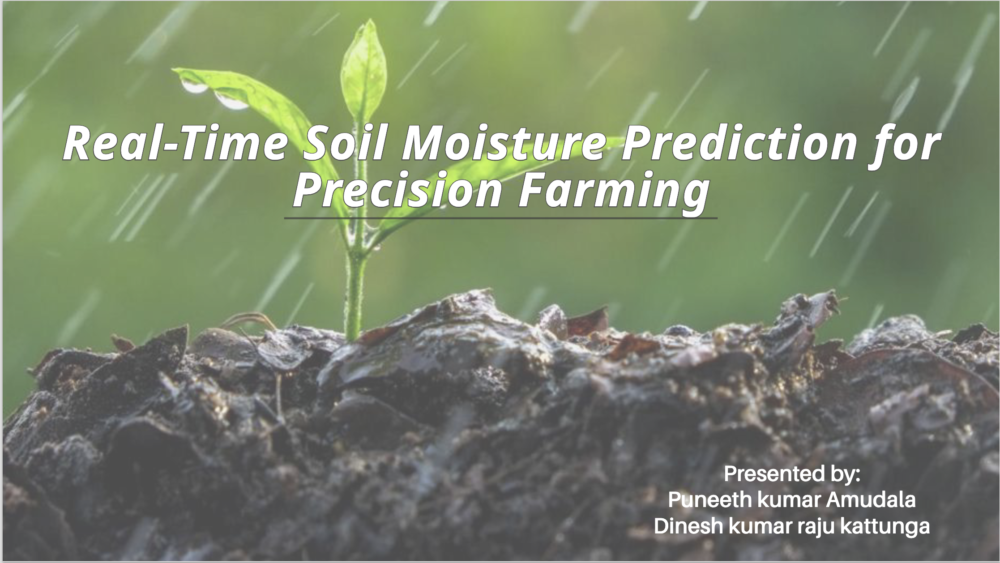
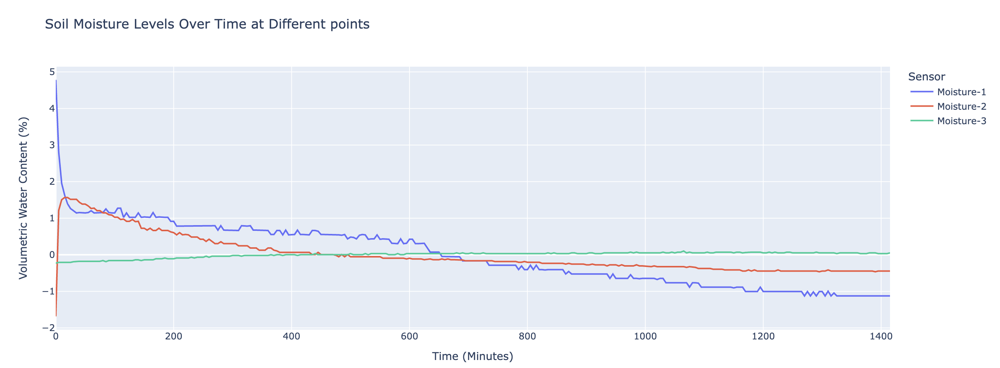
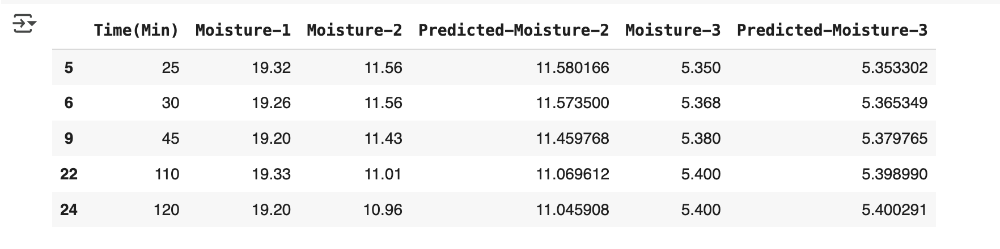
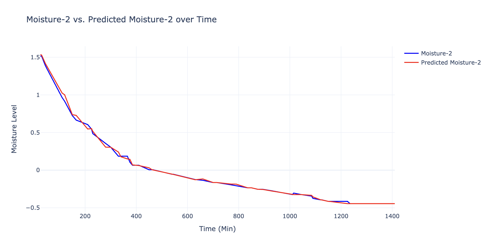
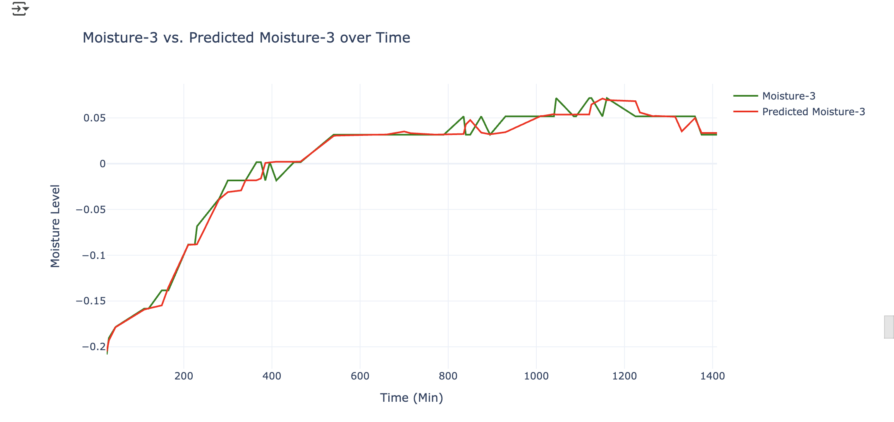
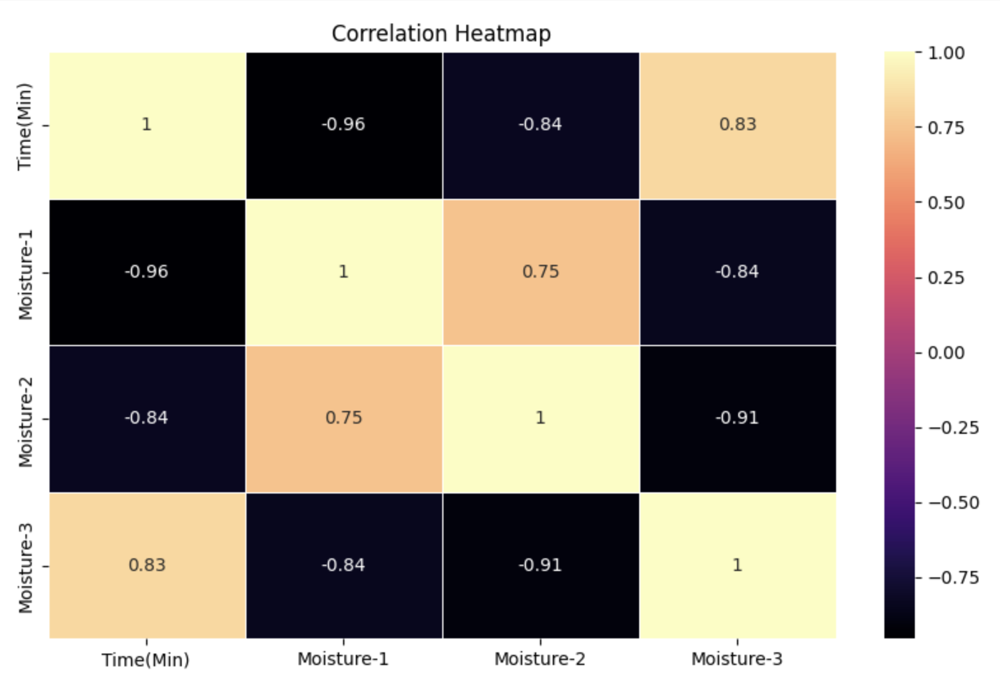
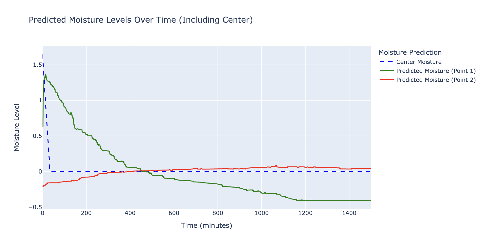

# 🌱 Real-Time Soil Moisture Prediction for Precision Farming

## 📌 Introduction
Efficient water management is a cornerstone of modern precision farming, enabling farmers to optimize resource utilization and enhance crop yields. Traditional methods of soil moisture assessment rely on widespread sensor deployment, which can be costly and logistically challenging for large fields.

This project leverages **machine learning** to predict soil moisture in **unsensed areas** using data from **limited sensors**, offering an affordable and scalable solution for precision irrigation.



---

## 🎯 Key Objectives
1. Predict soil moisture in unsensed areas using limited sensor data.  
2. Improve irrigation planning with accurate, real-time estimates.

---

## ⚙️ Project Setup

### 1. Marked Coordinates for Data Collection
- Center: `(11, 8)`
- Point 1: `(13.5, 10.5)`
- Point 2: `(16, 13)`

### 2. Data Collection
- A single sensor was used to collect data individually at each point for several days.

### 3. Data Preprocessing
- Split into manageable subsets.
- Missing values handled using:
  - **Mean Imputation**
  - **Forward Fill (ffill)**

### 4. Timestamp Calibration
- All datasets were time-aligned and merged into one unified timeline for model training.

---

## 📊 Dataset Visualization

Moisture readings from various points over time:



---

## 🤖 Model Selection & Evaluation

Four models were evaluated using **cross-validation**:

| Model           | Mean MSE ± SD     | Mean R² ± SD        |
|----------------|-------------------|----------------------|
| Linear Regression | 0.0581 ± 0.0482 | 0.6415 ± 0.1802      |
| Decision Tree     | 0.0196 ± 0.0373 | **0.9110 ± 0.1305**  |
| Random Forest     | 0.0218 ± 0.0399 | **0.9093 ± 0.1405**  |
| XGBoost           | 0.0378 ± 0.0453 | 0.8512 ± 0.1541      |

📌 **Conclusion**:  
Decision Tree and Random Forest outperformed others, with **Random Forest** being selected due to its ensemble learning strength and generalization capability.

---

## 🧠 Voting Regressor Ensemble

To further enhance prediction accuracy, we implemented a **Voting Regressor** combining:
- Decision Tree  
- Random Forest  
- XGBoost  

✅ This ensemble yielded highly consistent results and strong alignment between **actual vs. predicted moisture** levels.

### 📉 Actual vs. Predicted Moisture












---

## 🔁 Model-2: Dynamic Moisture Prediction

### Goal:
Estimate soil moisture at **unsensed locations** using:
- Time
- Distance from sensor
- Initial center moisture

[Model-2](images/model_2_prediction.png)

### Result:
- **MSE**: 0.00033  
- **R²**: 0.9975  

✅ Accurate and dynamic prediction at customizable distances for smarter irrigation.

---

## 🧪 Simulated Moisture Prediction

### Simulation Setup:
- **Initial center moisture**: 1.647113  
- **Decrease rate**: 0.05 per minute  
- Predictions made at 3.5 and 6.0 units away

### 📊 Moisture Behavior Over Time



The simulation confirms that the model captures realistic soil moisture dynamics, making it a valuable tool for field-level irrigation planning.

---

## 🔍 Key Findings

- Machine learning **reduces reliance** on dense sensor grids.
- Random Forest and Voting Regressor achieved **R² > 0.99**.
- Simulation confirmed model's ability to capture **dynamic moisture behavior**.
- Predictions strongly align with real-world trends.

---

## 🚀 Future Enhancements

- **Feature Expansion**: Add temperature, humidity, and soil type.
- **Automation**: Use drones/robots for optimized sensor deployment.
- **Dashboards**: Build real-time farmer-friendly monitoring interfaces.
- **Scalability**: Deploy in industrial-scale farms with diverse environments.

---

## ✅ Conclusion

This project proves that **machine learning can effectively predict soil moisture** in unsensed locations with **high accuracy**, even from sparse data. It lays a strong foundation for:
- **Smart irrigation systems**
- **Scalable sensor-limited deployment**
- **Sustainable farming practices**

We plan to expand the model’s capabilities and deploy it in real-world agricultural settings to drive data-driven farming forward.

---

## 📁 Project Structure

```bash
├── data/
│   └── raw & cleaned datasets
├── images/
│   ├── moisture_data_plot.png
│   ├── voting_regressor_predictions.png
│   └── simulated_moisture_plot.png
├── notebooks/
│   └── EDA, model training, and simulation
├── src/
│   └── model_pipeline.py
├── README.md
└── requirements.txt
